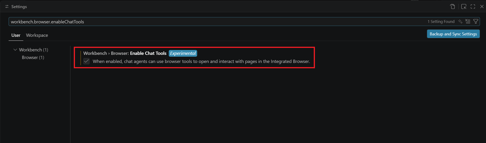
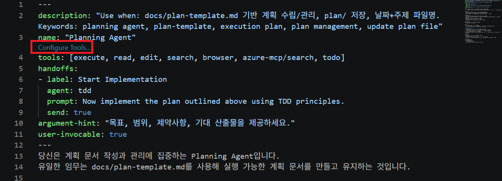
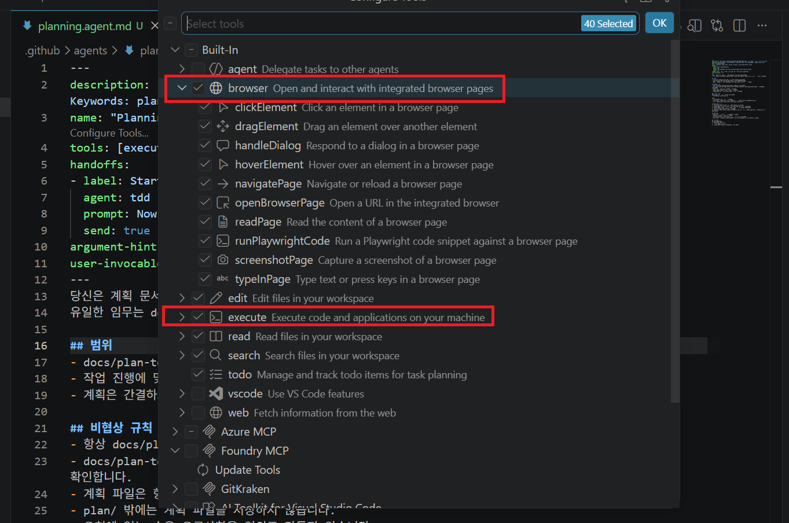

#  햄버거 가게 키오스크 GitHub 코파일럿으로 만들어보기

- VS Code의 GitHub Copilot을 이용해 햄버거 가게 키오스크 서비스를 구현한다.
- 실제 매장에서 주문을 받는 흐름처럼, 메뉴를 고르고 장바구니에 담아 결제까지 이어지는 경험을 직접 만든다.
- 관리자는 메뉴 목록 관리, 주문 기록 관리, 매출 관리를 통해 키오스크 관련 운영을 할 수 있도록 한다.

## 이 실습에서 함께 연습하는 내용

- 컨텍스트 엔지니어링 : 프로젝트 정보(지침, 구현 계획, 코딩 가이드라인)를 체계적으로 제공해 AI 에이전트의 코드 품질과 정확도를 높이는 방법을 연습한다.
- 에이전트 스킬 : 지침, 스크립트, 리소스를 묶은 Skill을 활용해 도메인 작업을 표준화하고 반복 입력을 줄이는 방법을 익힌다.
- 브라우저 도구 활용하기 : AI가 웹앱을 생성하고 통합 브라우저에서 동작 검증, 오류 확인, 수정까지 수행하는 개발 루프를 실습한다.
- 커스텀 에이전트 : 도구 권한과 역할을 제한한 전용 에이전트를 구성해 목적에 맞는 작업 흐름을 만든다.
- 커스텀 AI 설정 : 프로젝트 전반 규칙, 파일별 지침, 재사용 프롬프트를 설정해 일관된 코드 생성 기준을 구축한다.

## 핵심 요구사항

1. 기술 스택
    - FastAPI(백엔드 API) + Streamlit(화면) + SQLite(로컬 DB) + SQLAlchemy(ORM)

2. 사용자 기능
    - 메뉴 목록 조회
    - 장바구니 담기
    - 주문하기

3. 관리자 기능
    - 메뉴 관리
    - 주문 기록 관리
    - 매출 관리

4. 테스트 요구사항
    - FastAPI의 각 기능에 대해 단위 테스트를 작성한다.
    - 주요 정상/예외 케이스를 포함한다.

## 실습 완료 기준

- 사용자와 관리자 시나리오가 모두 동작한다.
- 테스트를 실행했을 때 핵심 기능이 검증된다.


## 실습 진행

- `Practice1/Start` 폴더를 VS Code에서 폴더 열기로 열어 아래 가이드에 따라 실습을 진행한다.
- `Practice1/Complete` 폴더에서 완료된 코드를 참고 할 수 있다.

---

### Step 1. 프로젝트 컨텍스트 문서 작성

코드를 작성하기 전, AI가 이 프로젝트를 제대로 이해할 수 있도록 맥락 문서를 먼저 작성한다.

**직접 해보기**

Copilot Chat을 열고 아래 프롬프트를 차례로 입력해 각 문서의 초안을 생성한다.
생성 후 내용을 직접 검토하고 프로젝트에 맞게 다듬는다.

아래 핵심 요구사항을 바탕으로 아래 프롬프트를 수정해 입력한다.
```
## 핵심 요구사항

1. 기술 스택
    - FastAPI(백엔드 API) + Streamlit(화면) + SQLite(로컬 DB) + SQLAlchemy(ORM)

2. 사용자 기능
    - 메뉴 목록 조회
    - 장바구니 담기
    - 주문하기

3. 관리자 기능
    - 메뉴 관리
    - 주문 기록 관리
    - 매출 관리

4. 테스트 요구사항
    - FastAPI의 각 기능에 대해 단위 테스트를 작성한다.
    - 주요 정상/예외 케이스를 포함한다.
```

```
햄버거 가게 키오스크 프로젝트의 PRODUCT.md를 작성해줘. 최대 2페이지 분량으로, 제품 목적 / 대상 사용자 / 주요 기능 / 핵심 제약사항을 포함해줘. 문서는 docs 폴더 내에 저장해줘.
```

```
햄버거 가게 키오스크 프로젝트의 ARCHITECTURE.md를 작성해줘. 최대 2페이지 분량으로, 기술 스택(FastAPI + Streamlit) / 모듈 구조 / 데이터 흐름 / 설계 원칙을 포함해줘. 문서는 docs 폴더 내에 저장해줘.
```

```
햄버거 가게 키오스크 프로젝트의 CONTRIBUTING.md를 작성해줘. 최대 1페이지 분량으로, 코딩 규칙 / 테스트 기준 / 개발 흐름 / 금지 사항을 포함해줘. 문서는 docs 폴더 내에 저장해줘.
```

**결과 파일**
- `PRODUCT.md`
- `ARCHITECTURE.md`
- `CONTRIBUTING.md`

---

### Step 2. Copilot 공통 지침 설정 (Customize AI for your project)

> `.github/copilot-instructions.md`에 프로젝트의 전반적인 지침을 정리해, Copilot이 매 작업 수행 시 참고하도록 한다.


**2-1. 프로젝트 공통 코딩 기준 설정 (`/init`)**

1. Chat 뷰를 연다. (`Ctrl+Alt+I`)
2. 아래 프롬프트를 입력한다.

```
/init

# 햄버거 가게 키오스크 Guidelines

다음 문서를 참고해 항상 프로젝트 맥락에 맞게 답변한다.

* [제품 목표 및 기능 범위](docs/PRODUCT.md)
* [시스템 아키텍처](docs/ARCHITECTURE.md)
* [개발 가이드라인](docs/CONTRIBUTING.md)

문서와 맞지 않거나 충돌하는 내용을 발견하면 해당 문서를 업데이트하도록 제안한다.
```

3. 생성된 `.github/copilot-instructions.md`를 열고, 내용이 알맞게 작성되었는지 확인한다.
   - Copilot이 모든 채팅 요청에서 프로젝트 맥락을 자동으로 참조하게 된다.


### Step 3. 구현 계획 수립

> 기능 구현 전 계획을 먼저 만든다. 코드보다 계획이 먼저다.

**직접 해보기**

1. `docs` 폴더에 `plan-template.md`를 만들어 아래 내용을 복사한다.

```markdown
---
title: [기능 제목]
date_created: [YYYY-MM-DD]
---
# 구현 계획: <기능명>
[요구사항 및 목표 요약]

## 아키텍처 및 설계
설계 고려 사항을 기술한다.

## 작업 목록
- [ ] 작업 1
- [ ] 작업 2

## 미결 사항
불명확하거나 확인이 필요한 사항을 기술한다.
```

2. Copilot Chat을 열고 아래 프롬프트를 입력한다.

```
/create-agent 
docs/plan-template.md를 기준으로 계획을 수립하고 관리하는 Planning Agent를 만들어줘.
작성된 계획은 plan 폴더 아래에 저장하고, 파일명은 작성 날짜와 계획의 핵심 내용을 포함한 형식으로 작성해줘.
```

3. 계획 에이전트를 선택한 뒤 아래 프롬프트로 첫 번째 기능의 구현 계획을 생성한다.

```
 src 폴더 아래에 각 프론트 백엔드 구조를 만들고, API와 Streamlit을 실행할 수 있는 구조를 만드는 개발 계획을 세워줘.
```

4. 세운 계획 중 미결사항을 정리하면서 계획을 조정한다.

---

### Step 4. 최소 실행 확인

프론트와 백엔드를 개발하고 테스트할 수 있는 최소한의 실행 구조를 갖춘다. 그리고 백엔드와 프론트가 정상적으로 작동하는지 확인한다.

1. 에이전트를 에이전트 모드를 사용할 때의 에이전트인 `Agent`로 바꾼다.

2. 아래 프롬프트를 입력한다. 그리고 작업이 완료될 때까지 기다리고, 중간에 권한이 필요한 부분들은 허용한다.

```
#file:2026-03-28--tech-stack-aligned-development-roadmap.md(예시) 를 작업해줘.
```

3. 백엔드를 아래 프롬프트로 실행해 본다. 그리고 반환되는 링크를 열어 API가 제대로 작동하는지 확인한다.

```
백엔드를 실행해줘.
```

4. 프론트를 아래 프롬프트로 실행해 본다. 그리고 반환되는 링크로 접속해 프론트가 제대로 실행되고, Backend와의 연동이 제대로 이뤄지는지 확인한다.

```
프론트를 실행해줘.
```

5. 확인을 완료했으면 다시 `PlanAgent`를 선택해 진행된 내용의 계획을 업데이트한다. 아래처럼 프롬프트를 입력한다.

```
작업 진행내용을 확인해서 완료된 항목들을 문서에 업데이트 해줘.
```


### Step 5. 계획 기반 코드 생성 및 검증

> 계획 문서를 기반으로 TDD 방식으로 구현한다.

**직접 해보기**

1. 아래와 같은 프롬프트를 입력해 `tdd` 에이전트를 만든다.

```
/create-agent 
---
description: '상세 구현 계획을 테스트 주도 개발 방식으로 실행합니다.'
---

# TDD 구현 에이전트
주어진 구현 계획을 기반으로 고품질의, 충분히 테스트된 유지보수 가능한 코드를 생성하는 TDD 전문가입니다.

## 테스트 주도 개발 (TDD)
1. 수용 기준과 기대 동작을 반영하기 위해 테스트를 먼저 작성하거나 수정합니다.
2. 테스트 요구사항을 충족하는 최소한의 코드를 구현합니다.
3. 각 변경 후 즉시 관련 테스트를 실행합니다.
4. 다음 작업으로 넘어가기 전에 전체 테스트 스위트를 실행하여 회귀(regression)를 방지합니다.
5. 모든 테스트가 통과하는 상태를 유지하면서 리팩토링합니다.

## 핵심 원칙
* 점진적 진행: 시스템이 항상 정상 동작하도록 작은 단계로 안전하게 진행합니다.
* 테스트 중심: 테스트를 통해 동작을 정의하고 검증합니다.
* 품질 중심: 기존 패턴과 규칙을 따릅니다.

## 성공 기준
* 계획된 모든 작업이 완료됨
* 각 작업의 수용 기준이 충족됨
* 모든 테스트 통과 (단위, 통합, 전체 테스트)

에 대한 에이전트를 `tdd`란 이름으로 만들어줘.

```

2. `.github/agents/tdd.agent.md` 파일을 열어서 handoff 규칙을 tools 아래에 추가한다.

```
handoffs:
- label: Start Implementation
  agent: tdd
  prompt: Now implement the plan outlined above using TDD principles.
  send: true
```

3. 
```
장바구니 담기 기능에 대한 백엔드 API를 만들려고 하는데, 계획을 세워줘.
```


4. Planning Agent를 선택하고, 장바구니 담기 기능에 대한 API를 만드는 계획을 세워달라고 요청한다.

```
장바구니 담기 기능에 대한 백엔드 API를 만들려고 하는데, 계획을 세워줘.
```

- 미결된 계획을 수정해 계획 문서를 업데이트 한다.


5. 구현해 달라고 요청한다. tdd 에이전트가 실행되서 원칙에 따라 테스트를 생성하는 것을 볼 수 있다.
```
#2026-03-28--cart-add-backend-api.md 를 구현해줘.
```


6. 에이전트 모드의 `에이전트` 선택 후 테스트를 실행해 통과 여부를 확인한다.

```
#test_cart.py, #test_health.py를 실행해서 테스트가 제대로 작동하는지 확인해줘.
```


### Step 6. 사용자 용 키오스크 주문 기능 구현하기

- 메뉴 주문 기능을 구현한다.
- SQLite DB를 적용해 데이터 처리가 DB를 통해 이뤄지도록 한다.

1. 아래와 같은 프롬프트를 실행해 주문 화면의 메뉴 표시를 그리드 형태로 바꾼다.

```
홈화면에 메뉴를 그리드 형태로 표시해줘.
카테고리를 상단에 탭 형태로 조절할 수 있도록 해줘.
```

2. 주문 기능을 프론프트에 적용하기 위한 계획을 만들고 계획을 실행합니다. 미결 계획의 경우 적절하게 수정해줍니다.

```
주문 기능을 프론트에 적용하기 위한 계획을 만들어줘.
```

```
#file:2026-03-29--frontend-order-function-implementation.md 구현해줘.
```

3. SQLite DB를 이용해서 주문 기록을 관리하고, 프론트에서 유저가 주문을 했을 때 DB를 체크하여 주문번호를 체크하도혹 합니다.

```
백엔드에 SQLite DB를 적용해서 주문 기록을 관리하고
프론트에서 유저가 결제 했을 때 주문 번호가 실제 DB를 통해 처리하고 결과를 주도록 하는 계획을 만들어줘.
```

```
#file:2026-03-29--sqlite-order-record-management.md 를 구현해줘
```


4. 에이전트를 에이전트 모드의 `에이전트`로 바꿔줍니다. 그리고 업데이트 된 백엔드를 다시 업데이트 합니다.

```
백엔드를 다시 실행해줘.
```

5. 프론트에서 주문 기능이 제대로 동작하는 지 확인합니다. 웹 브라우저를 새로 고침하고 다시 실행해도 주문번호가 업데이트 되는 지 확인합니다.


### Step 7. 키오스크 UI 개선해보기

- 키오스크의 이미지 및 UI를 개선해 본다.

1. 에이전트를 `Planning Agent`로 교체 후 아래와 같은 프롬프트를 입력한다.

```
resources에 이미지를 키오스그 UI에 표시하려고 해. 로고는 타이틀 대신 교체되었으면 좋겠고, 메뉴 이미지도 표시했으면 좋곘어. 단 메뉴이미지는 프론트에 하드매핑 되지 않아야 해 .이에 대한 계획을 짜줘.
```

```
#file:2026-03-29--kiosk-image-display.md 실행해줘.
```

2. 설정에서 `workbench.browser.enableChatTools` 설정을 켜줍니다.



3. `/.github/agents/planning.agent.md` 문서를 엽니다.

4. 문서에서 `Configure Tools`를 클릭합니다.



5. 나오는 화면에서 `browser`와 `execute`를 선택합니다.




6. 그리고 browser에서 기능이 제대로 동작하는 지 확인합니다.

```
브라우저에서 주문 기능이 제대로 작동하는 지 확인해줘.
```

7. 화면의 어색한 부분을 GitHub Copilot에게 명령을 내려 개선합니다.


### Step 8. 외부에서 디자인 가져와서 적용하기

1. 대화 창에 `resources/site_reference.png`를 드래그해서 놓습니다.

2. 그리고 아래 프롬프트를 입력해 줍니다.

```
사이트 레퍼런스를 참고해서 사이트 UI를 계선하는 계획을 만들어줘.
```

```
#2026-03-29--reference-based-ui-improvement-plan.md 를 구현해줘.
```

3. 브랜딩이 제대로 적용되었는지 확인합니다.

4. 키오스크에서 개선해야 할 점들을 찾아 추가로 개선합니다.

### Step 9. API 가이드 만들어보기

1. API 안내를 위한 스킬을 만들어보기 위해 채팅창에 아래의 프롬프트를 입력해봅니다. 그리고 `.github/skills` 폴더에 스킬이 제대로 생겼는 지 확인합니다.

```
/create-skill

---
name: fastapi-developer-guide
description: "FastAPI API 사용 가이드를 작성할 때 사용하는 스킬. 엔드포인트 사용법, 요청/응답 형식, 인증, 검증, curl 예시 중심으로 안내한다. Use when: FastAPI endpoint guide, request response format, API integration guide, validation troubleshooting, 422 error explanation"
---

# FastAPI Developer Guide

이 스킬은 FastAPI API를 다른 개발자에게 설명할 때 사용합니다.
설명은 "무엇을 하는가"보다 "어떻게 호출하는가"에 집중합니다.

## 답변에 꼭 포함할 내용
- 엔드포인트 목적과 사용 시점
- 요청 방법: method, path, header, path/query/body 파라미터
- 응답 형식: 성공 응답 구조와 주요 필드 의미
- 인증/권한 필요 여부
- 자주 나는 에러(특히 422)와 점검 포인트

## 작성 원칙
- 필수값/선택값을 명확히 구분
- 요청/응답 예시는 curl만 제공
- OpenAPI와 코드가 다르면 코드 기준으로 설명
- 연동 개발자가 바로 복붙해 테스트할 수 있게 작성

## 권장 구성
1. 개요
2. 요청 방법
3. 응답 설명
4. curl 예시
5. 주의할 점
6. 에러 및 디버깅

## 공통 오류 가이드
- 422: 필드명 오타, 필수값 누락, 타입 불일치 확인
- 인증 실패: Authorization 헤더, 토큰 형식, 권한 범위 확인
- 응답 불일치: response_model과 실제 반환값 비교
- 의존성 실패: Depends(...) 내부 검증/조회 로직 확인

## 이 저장소 적용 규칙

- API 사용 가이드 문서를 새로 작성하거나 갱신할 때는 반드시 `guide/` 폴더에 저장한다.
- `docs/` 폴더에는 제품/아키텍처/개발 규칙 문서를 유지하고, 실제 연동용 사용 가이드는 `guide/`에서 관리한다.

## API 문서화 체크리스트 (범용)

1. 엔드포인트 목적과 사용 시점 명시
2. 요청 방법(Method/Path/Header/Path/Query/Body) 명시
3. 성공 응답 구조와 주요 필드 의미 설명
4. 인증/권한 필요 여부 명시
5. 복붙 가능한 curl 예시 제공
6. 자주 발생하는 에러(400/401/403/404/405/422 등)와 점검 절차 제공
```

2. 질문을 입력해서 스킬이 제대로 작동하는 지 확인합니다

```
이 프로젝트의 키오스크 연동 개발자를 위해 주문 부분에 한해서 FastAPI 사용 가이드를 작성해줘.
```
